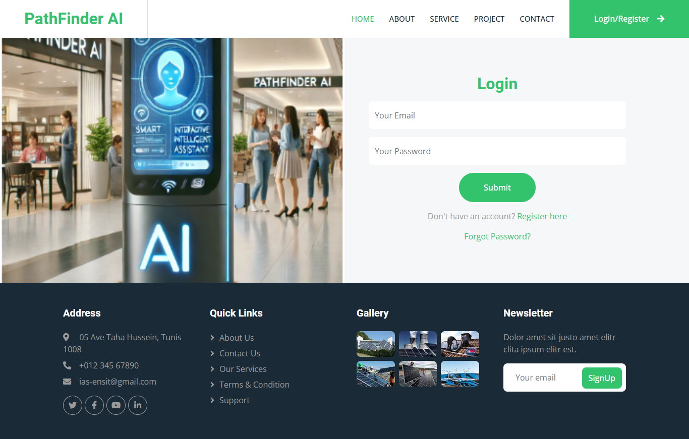
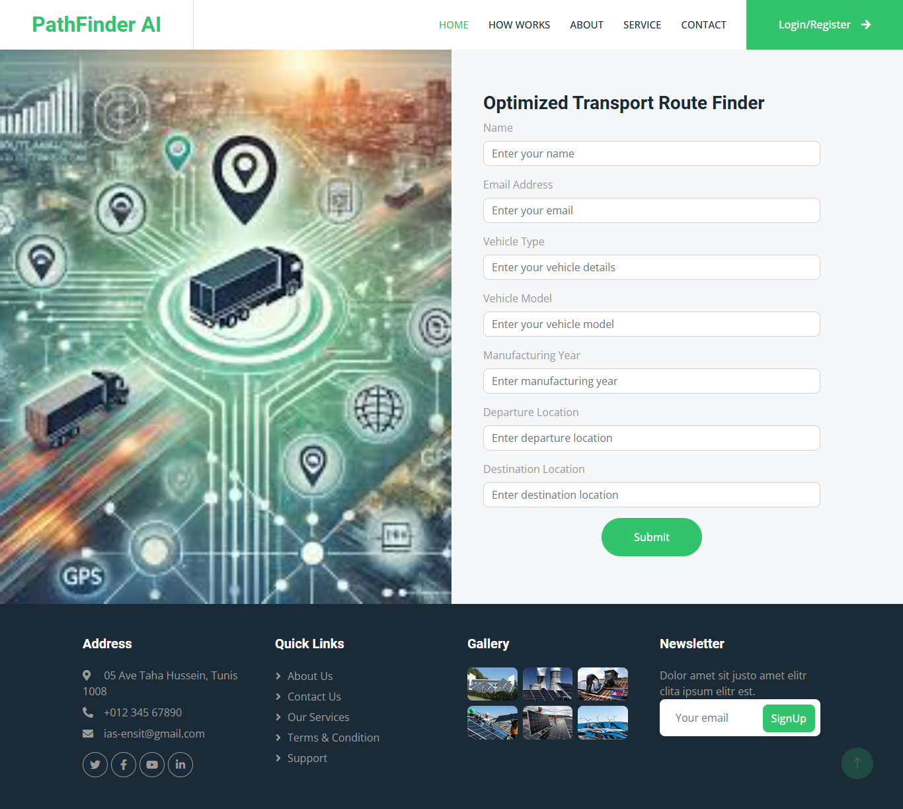
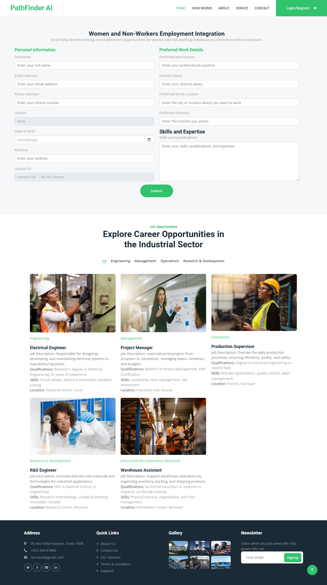

# PathFinder AI

PathFinder AI is an innovative platform designed to assist individuals in finding personalized career opportunities in the industrial sector, focusing on youth and women. The AI-powered system analyzes user information to recommend tailored career paths and skills development opportunities. PathFinder AI aims to contribute to the industrial transformation in Tunisia by empowering underrepresented communities.

## Features

- Personalized Career Recommendations: Users can input their experience, skills, salary expectations, and preferences, and receive AI-generated job recommendations.
- Industry Insights: Access to industry-specific roles, skills, and qualification requirements.
- Real-Time Data Analysis: The platform collects data and provides solutions in real time.
- Skills Development: Recommendations for training and skills development based on personalized career paths.
- QR Code Integration: Use personalized QR codes to connect with job platforms or industry websites.

## Installation

To run the project locally, follow these steps:

1. Clone the repository:
   ```bash
   git clone <repository_url>
   ```

2. Install the dependencies:
   ```bash
   npm install
   ```

3. Start the development server:
   ```bash
   npm start
   ```
   
## Screenshots   







